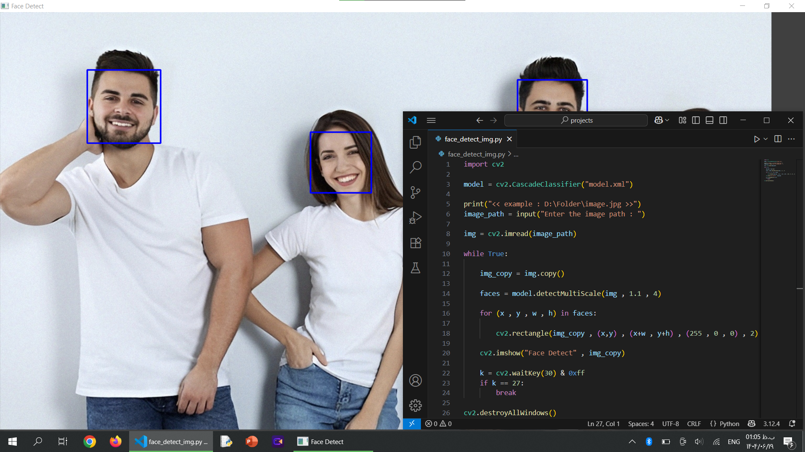

# پروژه تشخیص چهره با OpenCV

این پروژه یک برنامه برای **تشخیص چهره در تصاویر** با استفاده از کتابخانه قدرتمند [OpenCV](/https://opencv.org) است.
کاربر مسیر تصویر ورودی را وارد می‌کند و برنامه با استفاده از **مدل طبقه‌بندی آبشاری (CascadeClassifier)** چهره‌ها را شناسایی کرده و دور آنها مستطیل رسم می‌کند.

- - - - - - - - - -

## ویژگی ها
- تشخیص چهره در تصاویر ثابت
- استفاده از الگوریتم های آماده OpenCV
- نمایش تصویر به همراه چهره‌های شناسایی شده
- توقف برنامه با فشردن کلید `ESC`

- - - - - - - - - -

## پیش‌ نیازها
برای اجرای این پروژه باید پایتون و کتابخانه زیر نصب باشند:
`pip install opencv-python`

- - - - - - - - - -

## نحوه اجرا
1. ابتدا ریپازیتوری را کلون یا دانلود کنید:
`git clone https://github.com/mahan-mohebbi-kh/FaceDetect_Image.git cd FaceDetect_Image`

2. فایل مدل (model.xml) در پوشه‌ی پروژه قرار دارد و نیازی به دانلود جداگانه نیست.

3. اجرای برنامه:
`python face_detect_img.py`

4. پس از اجرای برنامه مسیر تصویر را وارد کنید:
`Enter the image path : D:/Folder/image.jpg`

5. تصویر به همراه چهره‌های شناسایی شده نمایش داده می‌شود.
برای بستن پنجره کلید **ESC** را فشار دهید.

- - - - - - - - - -

## توضیحات کد
- بارگذاری مدل تشخیص چهره --> cv2.CascadeClassifier
- خواندن تصویر ورودی --> cv2.imread
- شناسایی چهره‌ها در تصویر --> detectMultiScale
- رسم مستطیل دور چهره‌ها --> cv2.rectangle
- نمایش تصویر خروجی --> cv2.imshow

- - - - - - - - - -

## تصاویر خروجی برنامه

